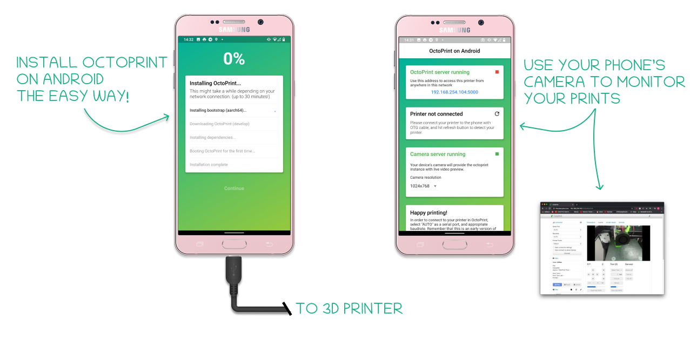
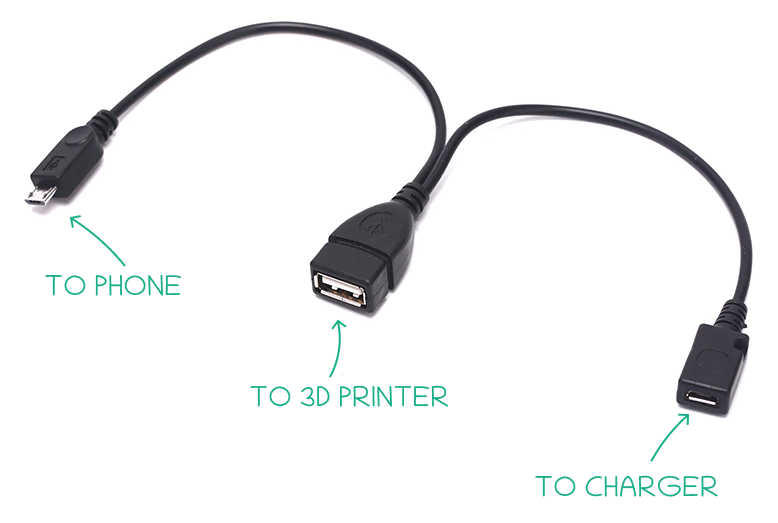

# octo4a



You don't have a Raspberry Pi, but you want to control your 3D printer remotely? Use your phone as an octoprint host! With the Octo4a app you can install Octoprint on your android phone in minutes, without any special Linux knowledge.

## Download

Newest `.apk` files are available in the [releases page](https://github.com/feelfreelinux/octo4a/releases).

## Usage

1. Enable installing 3rd-party .apk in your phone's settings.
2. Install the apk file downloaded from the releases page.
3. Open the app.
4. Click "Install OctoPrint" to download and install OctoPrint
5. Allow the app to access the storage, if asked for permission.
6. Wait for the installation to complete. This may take a logn time, depending on your internet speed.
7. Click "Continue" when the installation finishes.
8. Optionally start the camera server to enable watching your printer from octoprint. 
9. Navigate to the IP address shown at the top in your browser to access and set-up OctoPrint.
10. Happy printing!

## Features

- Quick and easy octoprint installation.
- Printer connection via USB OTG. Thanks to our custom USB driver you can use octoprint even on phones without root access.
- Built-in camera support. You can use the built-in camera in your phone to see the progress of your 3D prins, instead of buing a separate module. The app also supports  octolapse.
- SSH support. You can easily log-in via ssh and customize your octoprint installation. 

## FAQ

### What are the requirements to run this app?

Octo4a should run on Android 5 (Lolipop) and newer, because it uses Termux under the hood. You will also need an USB OTG cable (preferably the Y type) and about 700 MB of free storage on your phone.

### Why cannot I download octo4a from the Play Store?

Unfortunately due to legal and technical limitations the Play Store does not allow apps like octo4a.

### How do I charge my phone and connect to the printer at the same time?

You can use an Y USB cable (search for "usb otg y cable", [example cable on Aliexpress](https://pl.aliexpress.com/item/4000478500211.html)). It splits the data and power cables between your printer and phone charger.



Unfortunately not all phones support charging and USB OTG at the same time. Sometimes the issue is on the software side and changing your ROM might enable charging via the Y cable.

Another workaround is to just use wireless charging if the phone supports it, and connect the printer via a normal OTG adapter.

If you don't care about your phone's condition you can also replace the battery inside with a 3.7V power supply, but we do not recommend this approach since it might cause damage to the phone and even start a fire.

### The performance of OctoPrint is poor when the screen is off. What can I do?

Please try disabling any battery optimizations in your phone settings. Also make sure that the phone is plugged in and charging. As a last resort you can prevent the screen from turning off by going to the the developer settings and checking "Stay Awake".

### My printer is not being detected by octo4a. The app says "Printer not connected" even though it is connected via USB.

It is possible that your printer has an uncommon USB vendor id/product id. This happens especially on exotic Chinese 3D printers and mainboards. The app [has a list of VIDs/PIDs](https://github.com/feelfreelinux/octo4a/blob/master/app/app/src/main/res/xml/device_filter.xml) which is used by Android to choose the app to handle the device. Please leave a message on the Telegram channel or create an issue so that we can adds your printer.

### I need help with using this app. Is there any way I can get support?

You can join our group on telegram for support [https://t.me/octo4achat](https://t.me/octo4achat) and if you found a bug or a program you can [create an issue](https://github.com/feelfreelinux/octo4a/issues/new).


## Contributing

Pull requests are welcome. For major changes, please open an issue first to discuss what you would like to change.


## Disclaimer

```
THE SOFTWARE IS PROVIDED "AS IS", WITHOUT WARRANTY OF ANY KIND, EXPRESS OR IMPLIED, INCLUDING BUT NOT LIMITED TO THE WARRANTIES OF MERCHANTABILITY, FITNESS FOR A PARTICULAR PURPOSE AND NONINFRINGEMENT. IN NO EVENT SHALL THE AUTHORS OR COPYRIGHT HOLDERS BE LIABLE FOR ANY CLAIM, DAMAGES OR OTHER LIABILITY, WHETHER IN AN ACTION OF CONTRACT, TORT OR OTHERWISE, ARISING FROM, OUT OF OR IN CONNECTION WITH THE SOFTWARE OR THE USE OR OTHER DEALINGS IN THE SOFTWARE.
```

TL;DR: If your house burns down because this app malfunctioned, you cannot sue me.


## License

This project is licensed under the AGPL license.
